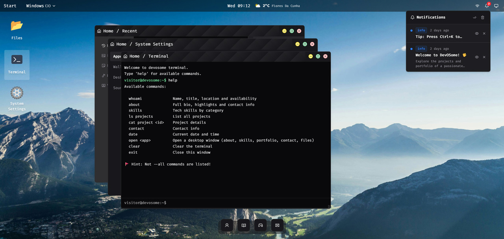

<div align="center">

# 🖥️ DevOSome

### An interactive, OS-style developer portfolio — boot into a desktop, drag windows, open a terminal.

[](https://devosome.vercel.app)

[](https://nextjs.org)
[](https://react.dev)
[](https://www.typescriptlang.org)
[](https://tailwindcss.com)
[](LICENSE)



</div>

---

## Overview

**DevOSome** reimagines the developer portfolio as a miniature operating system. Instead of scrolling a static page, visitors **boot** into an animated login screen and land on a fully interactive desktop — with **draggable, resizable windows**, a **taskbar**, a **dock**, a simulated **terminal**, and **Spotlight search** (`Ctrl + K`).

It's built to be both a playground for recruiters to explore and a real-world showcase of frontend engineering: a custom window manager, secure API integrations, dynamic SEO, accessibility, and automated tests.

## ▶ Live Demo

**[devosome.vercel.app](https://devosome.vercel.app)**

<video src="docs/demo.mp4" controls muted loop width="100%"></video>

> If the video doesn't play inline, [watch the demo clip](docs/demo.mp4) or open the [live demo](https://devosome.vercel.app).

## Features

**🪟 Desktop & Window Manager**

- Draggable & resizable windows with minimize / maximize / restore
- Focus and z-index management, tabbed windows, and a magnifying macOS-style dock
- Right-click context menus and keyboard shortcuts

**📦 Apps**

- **About**, **Skills**, and **Portfolio** showcases
- **Contact** form (email delivery via Resend)
- **Files** explorer with tabs (Documents, Images, Music, Videos) + PDF/media viewers
- Simulated **Terminal** (`whoami`, `skills`, `ls projects`, `open <app>`, …)
- **Clipboard History**, **System Monitor** (real browser metrics), **System Settings**

**🔔 System Tray / Taskbar**

- Live clock & calendar, **weather** widget (real data + geolocation)
- Light / Dark / Auto theme, battery & network status

**✨ UX**

- Notification Center, **Spotlight** global search (`Ctrl + K`)
- Animated boot screen, idle **screen saver** (Three.js), subtle UI sound effects

## 🛠 Engineering Highlights

The kind of decisions a portfolio should _demonstrate_, not just claim:

- **Custom window manager** built on [Zustand](https://github.com/pmndrs/zustand) — lifecycle, focus, z-index and tabs in [`src/stores/windows-store.ts`](src/stores/windows-store.ts), covered by **unit tests** ([`windows-store.test.ts`](src/stores/windows-store.test.ts)).
- **Secrets stay on the server** — the weather API key is proxied through [`/api/weather`](src/app/api/weather/route.ts) and never ships to the client bundle.
- **Hardened contact endpoint** ([`/api/contact`](src/app/api/contact/route.ts)) — Zod validation, HTML escaping against XSS, honeypot + timestamp + in-memory rate limiting, and fail-fast environment validation.
- **Dynamic SEO** — OpenGraph image generated at the edge with `next/og` ([`opengraph-image.tsx`](src/app/opengraph-image.tsx)), plus [`robots.ts`](src/app/robots.ts) and [`sitemap.ts`](src/app/sitemap.ts).
- **Quality gates** — strict TypeScript, a clean ESLint run, Vitest tests, and a global error boundary ([`error.tsx`](src/app/error.tsx)).

## 🧱 Tech Stack

| Area               | Technologies                                    |
| ------------------ | ----------------------------------------------- |
| Framework          | Next.js 16 (App Router), React 19               |
| Language           | TypeScript                                      |
| State              | Zustand                                         |
| Styling / UI       | Tailwind CSS v4, Radix UI, Lucide / React Icons |
| Animation / 3D     | Motion, GSAP, Three.js                          |
| Forms / Validation | React Hook Form, Zod                            |
| Email              | Resend                                          |
| Docs / Media       | react-pdf                                       |
| Testing            | Vitest                                          |

## 🚀 Getting Started

### Prerequisites

- Node.js **≥ 20**
- npm (or yarn / pnpm / bun)

### Installation

```bash
git clone https://github.com/skycod3/devosome.git
cd devosome
npm install
```

### Environment variables

Copy `.env.example` to `.env.local` and fill in the values:

| Variable               | Purpose                                                                                                                                                |
| ---------------------- | ------------------------------------------------------------------------------------------------------------------------------------------------------ |
| `NEXT_PUBLIC_SITE_URL` | Public site URL (no trailing slash). Used for SEO metadata, `sitemap.xml` and `robots.txt`. Falls back to `http://localhost:3000`.                     |
| `WEATHER_API_KEY`      | [WeatherAPI.com](https://www.weatherapi.com/) key. Used server-side by `/api/weather` — **not** `NEXT_PUBLIC_`, so it never reaches the client bundle. |
| `RESEND_API_KEY`       | [Resend](https://resend.com/) API key for the contact form.                                                                                            |
| `RESEND_TO_EMAIL`      | Destination address that receives contact-form submissions.                                                                                            |

> **Resend sandbox note:** the contact route sends from `onboarding@resend.dev`,
> Resend's shared sandbox sender. Without a **verified domain**, Resend only
> delivers to the email address of the account that owns the API key. For
> production, verify your own domain and update the `from` address in
> `src/app/api/contact/route.ts`.

### Run

```bash
npm run dev
```

Open [http://localhost:3000](http://localhost:3000) in your browser.

## 📜 Available Scripts

| Script               | Description                      |
| -------------------- | -------------------------------- |
| `npm run dev`        | Start the development server     |
| `npm run build`      | Production build                 |
| `npm run start`      | Serve the production build       |
| `npm run lint`       | Run ESLint                       |
| `npm run test`       | Run the test suite once (Vitest) |
| `npm run test:watch` | Run tests in watch mode          |

## 🗂 Project Structure

```
src/
├── app/          # App Router: pages, layout, API routes, SEO (robots/sitemap/og)
├── components/   # UI, layout, windows, and per-app components
├── hooks/        # Reusable React hooks (windows, settings, sounds, …)
├── stores/       # Zustand stores (windows, settings, notifications, …)
├── constants/    # Static data & configuration (apps, skills, projects, …)
└── lib/          # Helpers (schemas, rate limiting, utilities)
```

## 👤 Author

**Jean Medeiros** — Frontend Developer

[](https://www.linkedin.com/in/skycod3)
[](https://github.com/skycod3)
[](mailto:jeamcrv@hotmail.com)

## 📄 License

Released under the [MIT License](LICENSE).
